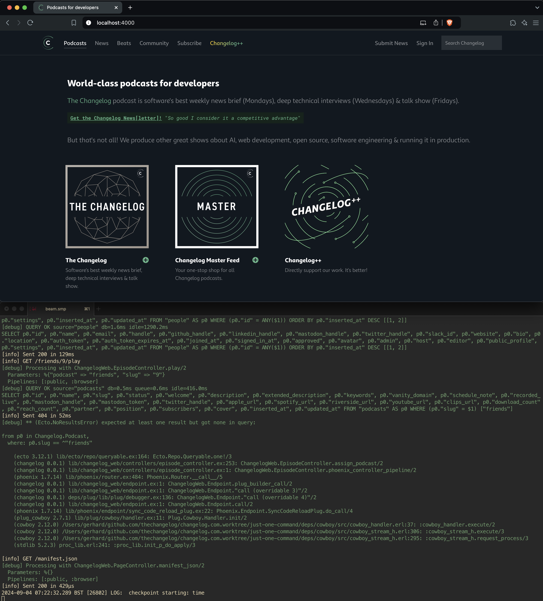

✅ By participating in this project you agree to abide by [our Contributor Code of Conduct](https://changelog.com/coc)

## How can I contribute?

We prefer small incremental changes that can be reviewed and merged quickly.
It's OK if it takes multiple pull requests to close an issue.

Each improvement should land in our primary branch within a few hours.
The sooner we can get multiple people looking at and agreeing on a specific change, the quicker we will have it out in production.
The quicker we can get these small improvements in production, the quicker we can find out what doesn't work, or what we have missed.

The added benefit is that this will force everyone to think about handling partially implemented features & non-breaking changes.
Both are great approaches, and in our 10years+ experience, they work really well in practice.

### 1/3. DCO

Contributions to this project **must** be accompanied by a [Developer Certificate of Origin](https://github.com/apps/dco) (DCO).

All commit messages **must** contain the `Signed-off-by: <USER> <EMAIL>` line.
They **must** match the commit author, otherwise commits cannot be merged.
When committing, use the `--signoff` flag:

```shell
git commit --signoff
```

### 2/3. Fork, clone & configure upstream

- [Fork](https://github.com/thechangelog/changelog.com/fork)
- Clone your fork
- Add the upstream repository as a new remote:

```console
git remote add upstream git@github.com:thechangelog/changelog.com.git
```

#### 💡 Alternatively, you can use the [`gh` CLI](https://cli.github.com/):

```console
gh repo fork thechangelog/changelog.com
# ✓ Created fork gerhard/changelog.com
# ? Would you like to clone the fork? Yes
# Cloning into 'changelog.com'...
# remote: Enumerating objects: 46047, done.
# remote: Counting objects: 100% (1015/1015), done.
# remote: Compressing objects: 100% (365/365), done.
# remote: Total 46047 (delta 643), reused 973 (delta 627), pack-reused 45032
# Receiving objects: 100% (46047/46047), 60.17 MiB | 17.64 MiB/s, done.
# Resolving deltas: 100% (34752/34752), done.
# ✓ Cloned fork

cd changelog.com
git remote -v
# origin	git@github.com:gerhard/changelog.com.git (fetch)
# origin	git@github.com:gerhard/changelog.com.git (push)
# upstream	git@github.com:thechangelog/changelog.com.git (fetch)
# upstream	git@github.com:thechangelog/changelog.com.git (push)
```

### 3/3. Create a pull request


```console
# Create a new branch
git checkout -b <DESCRIPTIVE-CHANGE-TITLE>

# Make changes to your branch
# ...

# Commit changes - remember to sign!
git commit --all --signoff

# Push your new branch
git push <DESCRIPTIVE-CHANGE-TITLE>
```

Create a new pull request via https://github.com/thechangelog/changelog.com

## How do I run the application locally?

You will need to have the following system dependencies installed:
- [PostgreSQL](https://www.postgresql.org/download/) v16
- [Elixir](https://elixir-lang.org/install.html) v1.16
- [Erlang/OTP](https://www.erlang.org/downloads) v26 - usually installed as an Elixir dependency
- [Node.js](https://nodejs.org/en/download/) v20 LTS - [latest-v20.x](https://nodejs.org/download/release/latest-v20.x/)
- [Yarn](https://yarnpkg.com/getting-started/install) v1.22
- [Golang](https://go.dev/doc/install) v1.22 - if you want to run CI locally

We are using [`just`](https://github.com/casey/just) to manage `brew` & `asdf` which in turn manage all app dependencies for development.

Once you have [`just` installed](https://github.com/casey/just?tab=readme-ov-file#installation), running `just` in the root of this repository will produce the following output:

```console
just --list
Available recipes:
    [contributor]
    contribute                                   # Setup everything needed for your first contribution
    deps                                         # Get app dependencies
    dev                                          # Run app in dev mode
    install                                      # Install all system dependencies
    postgres-down                                # Stop Postgres server
    postgres-up                                  # Start Postgres server
    test                                         # Run app tests

    [team]
    envrc-secrets                                # Create .envrc.secrets with credentials from 1Password
    restore-dev-db-from-prod format="c"          # Delete & replace changelog_dev with a prod db dump
    tag-kaizen version episode discussion commit # Tag Kaizen $version with $episode & $discussion at $commit (recording date)
```

The only command that you need to run is `just contribute`.
As per the description, this will setup everything needed for your first contribution:
- installs all system dependencies (Postgres, Elixir, etc.)
- downloads app (Elixir) dependencies
- starts Postgres
- runs app tests
- runs app in dev mode

When the above succeeds, this is the end-result that you can expect to see on macOS 12, our team's development environment of choice:



> [!TIP]
> 1. If you want to see what a full setup on a blank MacBook Pro looks like, you can [watch this 3 minutes-long video](https://github.com/thechangelog/changelog.com/pull/521).
> 2. All the above works equally well on a Debian-based Linux distribution (tested on Ubuntu 22.04 & 24.04).

## How to upgrade 💜 Elixir, 🚜 Erlang/OTP & ⬢ Node.js?

1. Run e.g. `asdf install erlang latest:26`
    - If a new version gets installed, run `asdf local erlang <INSTALLED_VERSION>`
2. Repeat previous step for Elixir & Node.js
3. Commit & push to check that image builds successfully in GitHub Actions
    - _Alternatively_, build the image locally via: `$(cd magefiles && go run main.go -w ../ image:runtime)`

After you confirm that the image builds successfully:
1. Update `.devcontainer/docker-compose.yml` with new image tag
2. Ensure that Elixir minor version in `mix.exs` is accurate
3. Update Elixir, Erlang/OTP & Node.js version in `CONTRIBUTING.md` (this file)

Commit and push everything, then wait for all GitHub Actions checks to go green
✅ . At this point, one of the maintainers will review, approve & merge this
change. Thank you very much!

## Using GitHub Codespaces

A pre-configured Codespace can be launched for this repo by following the instructions [here](https://docs.github.com/codespaces/developing-in-codespaces/creating-a-codespace-for-a-repository). Everything you need to start contributing is installed and the following commands will start the site:

```console
# CONFIGURE APP
mix deps.get_dev
mix ecto.setup

# CONFIGURE STATIC ASSETS
cd assets
yarn install

# RUN APP
mix phx.server
```

### Codespaces + VS Code Web Editor

If you are developing in the VS Code web editor two extra steps are required for the site to be able to load static assets correctly. Port forwarding utilizes a dynamic HTTPS `*.preview.app.github.dev` URL when developing in the web editor.

1. Set the `CODESPACES_WEB` environment variable. This tells the app to construct appropriate static asset paths.

   ```console
   export CODESPACES_WEB=true
   ```

2. After running the app the URL it is exposed on is visible in the `Toggle Ports` VS Code view (port 4000). Launch that URL and configure your browser to allow it to load insecure content via the instructions [here](https://experienceleague.adobe.com/docs/target/using/experiences/vec/troubleshoot-composer/mixed-content.html). This is necessary to allow js/css to be accessible over HTTP when the `*.preview.app.github.dev` site is using HTTPS.
