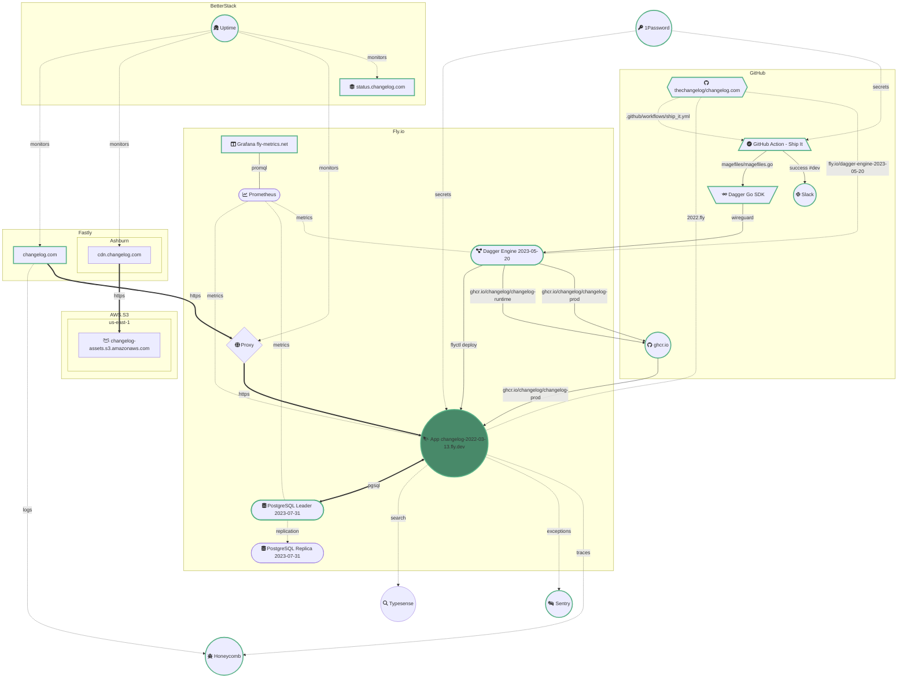

[](https://shipit.show/80)

This diagram shows the current changelog.com setup:



> **Note**
> [Continue live editing this Mermaid diagram](https://mermaid.live/edit#pako:eNqdWHlv2zYU_yqEig4tEEm2FceJu27I6i4t0m7d3G7A4qKgJFrmLIkqSTVx43z3PZI6KEfqMf9h63j3-72DvnUiFhNn7jx8iDZSFmLu-2uWS3xNBMuIF7HMFwTzaLPKE46LDXq7WOUIPlGKhViQNUppvkVCcrYl8wfTs3ByOjsyt-41jeVmHhQ3TwyP-QZVz0Ap-gGBBCKFeSrK0Ci4oPJFGZqH6sNJwW5v0RqH8zV2Eyo3ZYjkhkQbnCckZYnfXClz0d3dfD5XRrUiopRGWy0IrZzaTSNJezgsbeWscksOjeIrH0xRlkSURylxI-DdVkaj80hSliMXLTe0QC8lWq3eD1ijZH2vNT7W8oV_zfh2nbJr4QtQ9IFKb5elytZaR3uFS8kyrNiuVqsmiiwFsWiBk4RwdMHQcnGJ_CFTWxHfbXCYstDPsJCEw09C1jQlor3yEtaNMCcJBfDsHj06SHiyibhHGXr8eDC7hrPfRMYT0bWzwNEWzBAHGd5g2eoWKRChpf4eVKxYLKWt_5rbpA3qh34Cx5-NguX56V_PJ4deAzJdz_0J7T1jdH-G9xo1XTwiV7H1x3Zvpa4PGy2_KKOICIEexOTTXrtkqEge26VbG4r2k9Fk4q3THagoii5JlQctt0qb34MPt-Asttgj1XZoDnjUnCA7kimKSZEyW0ufMUCrlMQazi7JExDjgoWBO5rC776VXUcdetAbjJdQqU3Xq2WITcgwj1tDD_rTr5rQdll9wJmb3a3pDAmAnqA36sndAQV6-hR80zornzroq818dFU1GWD6l0TSjSkG7Vldsc-1i6h1Eb0fhGcT1hajla-gXwwGze4mBx2lKNoSKTaM5PTGXYN1RIEWnRcFapOscOKOAnccKLR4AK--ShJylxIlGAF00_mD49PTs5OzJ_caERD0e9GncNiDOLxuIhxjiUMsIF9MyIST5R-v0CuCYwiYCcbMDcbD4QVRXzWpMJKF2wr8km18_EXj_oSKoBHuWmejSEXpR42zIhEfoWmAjR3fq1bDjSDVHPZabUdI2_N1OV5TKOwS6qJTTPeA-_Wq52UuaUb2TaP4X1JM72hFtEIyIjmNRBw2QQQuLt1UFQzUJLzfkFLomB3wNAwsLbNcoAuO1zjHCLLqViReTiQampMVTRcPNqed9ZrYdaGBgTuZylRjfI8_ptVVtwcNcYiok_khooN86pbfdMkliXi7o5kbXf0qUFuyQ-M3sMVB4ceHdW1iUrH0DshxUbHqIVkHp-YwIK3uLH_b910CMxotw83WaljUdWM2jMicrnc0T6BVgwno7a4gguRQZ48rVKgaAgWVBsW9R_Ue3Kh4fhORQi9kVeSa-0ZVhLkbcZgpYE-upmJvkFpGK05CM6gCgOUF5_QzNrtfWwQZgbHgUyFKmPs_V6Pi6fTkBJrnpA6n7UmrZ2_ptDx6tvjNGokZgD8h3hrWN-hrKkcAlTVNSk7AOv6Jwsrgz5LLMLpcXl4sdh_fzV6WC34ckIvDmalF2C2K3Fyh7t4-uH0CbS98qvX8fgtt1J7DLC953m21UZxfqS_vQH1L1Sw93VL4PVRO45CmVFa-MPtRk_SwTNALlpMdyA37M95htLwrqbepObu9T40CdVpqH31gBUCEpERV8s7fQGtrkw4xMwUEhJBtdt_2GhiaSnIMyeyls_xX-IJZzTjAwlJk7zR6yznI_vnfS28Z9OSnFC4BZLjjbobMsfCqXjHwtbAWCvPSE4GHM_yZ5fD2y_mrct7dvKqDZ-Pba5ZT8AtawoHtvxAJZ5elhFXeXlewLJtxkeIdLFAJZ2VRvfG-DdmG2C75Hu7uSSFr7GzQBhsCHEMlyXMq0LtCDdfhw0rLb4NOM3mhdlXI-tQiCc78cRAEo4lf8YnOBGtlNTiq6fYaGQO0XULIzTfRWcj6CqUJowUB58jJCM8wjZ25c6terBzYAlS9zOEyxnyrHLsDOrX3LHd55EBoU0GOnLKAyiMLs383Twuc_8NY596Z3zo3ztydBSfeyWw0Ojs9nkxn0_HpkbNz5mdjb3w8nQWT2QgeT4Pp3ZHzWUsYe7NgGpwdj0bj0Wg2AnJo6-DIa_PHjP5_5u4_wV6tvQ)

Let's dig into how all the above pieces fit together.


## A three-tier monolith

TL;DR:
- **Front-end**
  - Fastly
  - Fly.io Proxy
  - AWS S3
- **Application**
  - Elixir / Phoenix
- **Database**
  - PostgreSQL

[changelog.com](https://changelog.com) is a monolithic
[Elixir](http://elixir-lang.org) application built with the
[Phoenix](http://www.phoenixframework.org) web framework. It uses
[PostgreSQL](https://www.postgresql.org) for persistence &
[Node.js](https://nodejs.org) to digest & compile static assets (CSS & JS).

Static assets, including all our mp3 episodes, are stored on AWS S3. They are
served via Fastly, specifically https://cdn.changelog.com. In summary:

```
Fastly (cdn.changelog.com)
↓
AWS S3 (changelog-assets.s3.amazonaws.com)
````

The production instance of our application is running on Fly.io. All
https://changelog.com requests are served via Fastly. Each Fastly request gets
proxied to our application instance via the Fly.io Proxy. In summary:

```
Fastly (changelog.com)
↓
Fly.io Proxy
↓
Application (changelog-2022-03-13.fly.dev)
```

The production database - PostgreSQL - is running on Fly.io too. It is a
replicated setup, with one leader & one replica. In summary:

```
Application (changelog-2022-03-13.fly.dev)
↓
PostgreSQL Leader
↓
PostgreSQL Replica
```


## Production deploys

Each commit made against our primary branch gets deployed straight into
production. The ["Ship It!" GitHub Actions
workflow](.github/workflows/ship_it.yml) is responsible for this. From the
workflow jobs perspective, it is fairly standard:

- **1/2. CI/CD**
  - Uses Dagger Go SDK so that it works exactly the same locally as it does in
    GitHub Actions
  - [Spins up a Dagger Engine as a Fly.io machine on-demand, then connects to
    it](https://github.com/thechangelog/changelog.com/pull/471) so that caching
    is reliable & persistent between workflow runs
  - A successful run publishes a container image to
    https://ghcr.io/thechangelog/changelog-runtime &
    https://ghcr.io/thechangelog/changelog-prod
  - Deploys to Fly.io
- **2/2. Notify**
  - Notifies `#dev` channel in changelog.slack.com if **CI/CD** succeeds


## Secrets

All our secrets are stored in [1Password](https://changelog.1password.com/), in
the **Shared** Vault. Currently, they are manually declared in Fly.io via
`flyctl`. They are pasted manually in [GitHub Actions
secrets](https://github.com/thechangelog/changelog.com/settings/secrets/actions).


## Metrics & observability

Since our application & database are running on Fly.io, we benefit from free
infrastructure metrics: https://fly-metrics.net

All logs from Fastly are streamed into Honeycomb.io. This allows us to ask
unknown questions about how various HTTP clients interact with our content. It
also helps us explore how Fastly interacts with Fly.io.

We also send app traces via OpenTelemetry to Honeycomb.io.

App errors - e.g. `Plug.Conn.InvalidQueryError` - show up in Sentry.io.

BetterStack.com monitors our public HTTPS endpoints & alerts us when they become unhealthy.


## Search

We use Typesense for search. It's near-instant & it just works.


## What is missing?

The above is what we have so far. While we like to keep things simple, our
setup is a constant work in progress. We keep making small improvements all the
time, and we talk about them every 10 weeks in the context of our [Ship It!
Kaizen episodes](https://changelog.com/topic/kaizen). For example, this diagram
and document were created in the context of [🎧 Kaizen 8: 24 improvements & a
lot more](https://shipit.show/80). If you would prefer to stay in reading mode,
check out [GitHub discussion
#433](https://github.com/thechangelog/changelog.com/discussions/433).

If anything on this page is missing, or could be clearer, please [open an
issue](https://github.com/thechangelog/changelog.com/issues/new/choose). Thank
you very much!

---

## How to upgrade our PostgreSQL instance running on Fly.io?

1. Provision a new PostgreSQL instance
```console
flyctl postgres create \
    --org changelog --region iad \
    --name changelog-postgres-2023-07-31 \
    --initial-cluster-size 2 \
    --vm-size performance-2x \
    --volume-size 10
```

2. Connect to newly created instance (we want to use the new `pd_dump`, with the latest improvements)
```console
flyctl ssh console --app changelog-postgres-2023-07-31
```

3. Create new db
```console
createdb changelog --host localhost --username postgres
```

4. Dump database to local file
```console
pg_dump --host postgres-2022-03-12.internal --username postgres changelog > changelog.sql
```

5. Restore database from local file
```console
psql --host localhost --username postgres --single-transaction changelog < changelog.sql
psql --host localhost --command 'ANALYZE VERBOSE;' changelog postgres 
```

> **Note**
> If a previous restore failed, run `dropdb --force --host localhost --username postgres changelog`, then `createdb ...` again.

6. Configure app to use new PostgreSQL instance
```console
flyctl secrets set DB_HOST=changelog-postgres-2023-07-31.flycast DB_PASS=<NEW_DB_PASSWORD> --app changelog-2022-03-13
```
