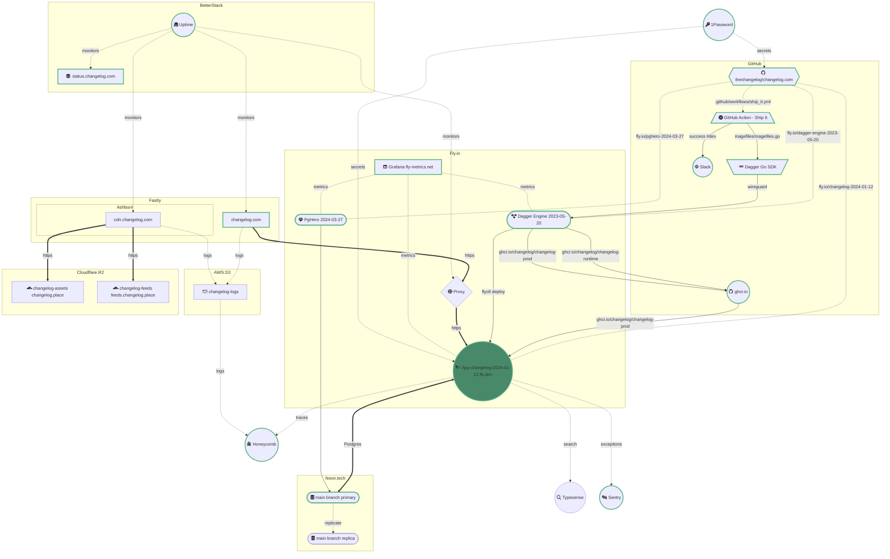

[](https://shipit.show/80)

This diagram shows the current changelog.com setup:



> [!TIP]
> [Continue live editing this Mermaid diagram](https://mermaid.live/edit#pako:eNqVWHlv2zYU_yqEihYtEEk-4iPusiFrurQI2gVzuwGLi4GSaJmLRGok1cSN8933SOqgHLlH_nBk6t3v9w763ot5QryF9_Qp2ihVyEUYrjlT-JZInpMg5nkoCRbxZsVSgYsN-nC-Ygj-4gxLeU7WKKPsBkkl-A1ZPJmcRKP57Mh-9W9pojaLcXH30vLYT1D1CpSiZwgkECXtqSwjq-CCqjdlZA_1nyAFv79Haxwt1thPqdqUEVIbEm8wS0nG07B50uaih4fFYqGNakXEGY1vjCC08mo3rSTj4WFpK2_FHDk0Tq5DMEVbElMRZ8SPgfemMhqdxYpyhny03NACvVVotfp0wBot60etCbGRL8NbLm7WGb-VoQRF_1AVbPNM21rraJ9wqXiONdv1atVEkWcgFp3jNCUCXXC0PL9E4SFTWxE_bHCU8SjMsVREwL-UrGlGZPsUpLwbYUFSCuDZPn--l_B0E4uAcvTixcHsWs5-E7lIZdfOAsc3YIbcy_AGq1a3zIAILc3nQcWaxVHa-m-4bdqgfuhncPzVYLw8m__5erTvNSDTD_yf0S6wRvdneGdQ08Uj8jVbf2x3Tur6sNHyyzKOiZToSUI-74xLloqwxC3d2lC0W2dbSEfrrT8ajI79wdAfjkBrUXS5qtQYVVUmwx7I-IXgicOeWHwaNlAYqwwlpMj41qH5inGW3ScspYxoA8f-YAL_d5XgOgWPGIt0QwSvXBr7o9kO2aOaA1rYFcZLKPSmadYq5SbiWCStU3vt7TdD2NoOLt9t721LSaFaCLrSJw97FOj0FIJgtFXOtwTWm-fXVWMC-n9JrPyEYlCZ11X-2oQBtWFAnw5Buop7C-rKO9ArD0bVbT97Lago2poqNpwweuevwTSiUY7OigL14SjQWgGPfaUn1TYjWjACrGeLJ8fz-cn05OWjzgUE_V70KewWpc14E9WU5OgqfQNHqMXF4RBa7gPKH-Grq9nptwb6txQqqARQtcDtpv7bhSVKpmhOdk0t_rgIW5stfysBULbGDNeRinlW5kyiC3uMwHM_J0rQWAaMKHRozFRiujFzOV2E1cSmbCuava7QT7IfwX6qutybHmgfNZ5-OjWleMWlSgXREiNxa19XSdehtId7tf-ecBYoopepJvpA12AswQpHWBKUY8pQJDCLN1D-NMfQPA9XK4hwBxAsCDwjELBKmcZcWDUFCZNQJ9SXvGSJP59OB8cn82lodcH4iIR_i1lCBGWpL3O9xc3mx9P5cHLSBSlo5cOvWw59FQzEYHnX32rUVa8V2Vlhj6INXXZJYtGuiPaL6SVa6Q3ZouEVLJHQRpL9LmFjU7H0zudhUbGaGV2Dq-awNlbfHGQdeK9nSMduuzNbDv3cWA0DmtH1Vsc31Ts0-rAtiCQMgvfiRQszP6gUaOYdqpfwRsPru5gUZhus4tZ8bzTFWPixgIkE5jA9f3tD1DI6UZKGQbcC2Jwwo1-wXTzbdpATmC8hlbIE1PxSwet0Mp1CIx7VwXQcadXsHJWOQ6_O3zvzNIeaTEmwhtURGqdOEOB6TdNSEDBOfKawroSz9DKKL5eXF-fb_z7O3pbn4nhMLvYHrhHhTiNyd426d4aDmy_Q9mKnuho8nnWN2jNYBErBujMxTti1_gj21LdUzcLl1EEr869lsBy3xMAvr-vBim-lM0b1q1puI9O480wbYNGriXZGipOH3yMdXxzRjKoqbNw9auAVlSl6wxnZggtRP7Y6jE4gSxpsas7uvNGNRF8K26N_eAFgJBnRzXkbbuBa2oWX9kQJHOtezB8bbyLh-ttD4zivYQzrBbTJlDhRc9cvs5DtpeZVxstknWFBgj9GDtjMDbfJUdxQOamyNA4iC7g4EBcUa0KSbwgxJJYwOCCpgQHkv7tOWgOeWXYHCu84oxAJaFV73v5KFNzolgouOO5OhlUp64mQ4S1siangZVG9Cb6v5iyx24t6uLuzKG_sbMAJ4wgu54owRiX6WOjl5_AVruV3MWqYgsi4KlV9l1ME5-FwPB4PRmHFJ91W4MiCzmd7X023M1g6QNslhBx9F52DxW9Q2jA6UPCOvJwIGNiJt_Du9YuVB1dkXV4LeEywuNGOPQCd3kiXWxZ7CyVKcuSVBdQpObcXDA_inUk4LTDzFvfenbfwZ-NpMJ0NBifz49FkNhnOj7yttzgZBsPjyWw8mg3geDKePBx5XzgHCcNgNp6MT44Hg-FgMBsAOYwXsPud_XXK_EhlFPxtyI3Ch_8BRPIPhw)

Let's dig into how all the above pieces fit together.


## A three-tier monolith

TL;DR:
- **Front-end**
  - Fastly
  - Fly.io Proxy
  - Cloudflare R2
- **Application**
  - Elixir / Phoenix
  - Typesense search
- **Database**
  - PostgreSQL (Neon.tech)

[changelog.com](https://changelog.com) is a monolithic
[Elixir](http://elixir-lang.org) application built with the
[Phoenix](http://www.phoenixframework.org) web framework. It uses
[PostgreSQL](https://www.postgresql.org) for persistence &
[Node.js](https://nodejs.org) to digest & compile static assets (CSS & JS).

Static assets, including all our mp3 episodes, are stored on Cloudflare R2.
They are served via Fastly, specifically https://cdn.changelog.com.

```
Fastly (cdn.changelog.com)
↓
Cloudflare R2 (changelog.place)
````

The production instance of our application is running on Fly.io. All
https://changelog.com requests are served via Fastly. Each Fastly request gets
proxied to our application instance via the Fly.io Proxy.

```
Fastly (changelog.com)
↓
Fly.io Proxy
↓
Application (changelog-2024-01-12.fly.dev)
```

The production database - PostgreSQL - is running on Neon.tech. It is a
replicated setup, with one leader (RW) & one replica (RO). We are currently not
using the replica, and since Neon.tech scales down to 0, this isn't costing
anything.

```
Application (changelog-2024-01-12.fly.dev)
↓
PostgreSQL Leader (RW)
↓
PostgreSQL Replica (RO)
```


## Production deploys

Each commit made against our primary branch gets deployed straight into
production. The ["Ship It!" GitHub Actions
workflow](.github/workflows/ship_it.yml) is responsible for this. From the
workflow jobs perspective, it is fairly standard:

- **1/2. CI/CD**
  - Uses Dagger Go SDK so that it works exactly the same locally as it does in
    GitHub Actions
  - [Spins up a Dagger Engine as a Fly.io machine on-demand, then connects to
    it](https://github.com/thechangelog/changelog.com/pull/471) so that caching
    is reliable & persistent between workflow runs
  - A successful run publishes a container image to
    https://ghcr.io/thechangelog/changelog-runtime &
    https://ghcr.io/thechangelog/changelog-prod
  - Deploys to Fly.io
- **2/2. Notify**
  - Notifies `#dev` channel in changelog.slack.com if **CI/CD** succeeds


## Secrets

All our secrets are stored in [1Password](https://changelog.1password.com/), in
the **changelog** vault. We are declaring a single secret in Fly.io,
`OP_SERVICE_ACCOUNT_TOKEN`, and then loading all other secrets into memory part
of app boot via `op` & `env.op`.

In [GitHub Actions
secrets](https://github.com/thechangelog/changelog.com/settings/secrets/actions),
we are still pasting them manually. That is something that should use `op` too.


## Metrics & observability

Since our application & database are running on Fly.io, we benefit from free
infrastructure metrics: https://fly-metrics.net

All logs from Fastly are streamed into Honeycomb.io. This allows us to ask
unknown questions about how various HTTP clients interact with our content. It
also helps us explore how Fastly interacts with Fly.io.

We also send app traces via OpenTelemetry to Honeycomb.io.

App errors - e.g. `Plug.Conn.InvalidQueryError` - show up in Sentry.io.

BetterStack.com monitors our public HTTPS endpoints & alerts us when they become unhealthy.


## Search

We use Typesense for search. It's near-instant & it just works.


## What is missing?

The above is what we have so far. While we like to keep things simple, our
setup is a constant work in progress. We keep making small improvements all the
time, and we talk about them every few months in the context of our [Ship It!
Kaizen episodes](https://changelog.com/topic/kaizen). For example, this diagram
and document were created in the context of [🎧 Kaizen 8: 24 improvements & a
lot more](https://shipit.show/80). If you would prefer to stay in reading mode,
check out [GitHub discussion
#433](https://github.com/thechangelog/changelog.com/discussions/433).

If anything on this page is missing, or could be clearer, please [open an
issue](https://github.com/thechangelog/changelog.com/issues/new/choose). Thank
you very much!

---

## How to create a new app instance?

1. Start by creating a new app, e.g. `flyctl apps create changelog-2024-01-12 --org changelog`
2. Copy the existing app instance config, e.g. `cp -r fly.io/changelog-{2023-12-17,2024-01-12}`
3. Run all following commands in the app directory, e.g. `cd fly.io/changelog-2024-01-12`
4. Update the app name in e.g. `fly.toml` to match the newly created app
5. From within the app directory, set a few secrets required by the app to work correctly while testing

        flyctl secrets set --stage \
            OP_SERVICE_ACCOUNT_TOKEN="$(op read op://changelog/op/credential --account changelog.1password.com --cache)" \
            R2_FEEDS_BUCKET=changelog-feeds-dev \
            URL_HOST=changelog-2024-01-12.fly.dev

6. Deploy the latest app image from <https://github.com/thechangelog/changelog.com/pkgs/container/changelog-prod>

        flyctl deploy --vm-size performance-4x --image <LATEST_IMAGE_SHA>


## How to load data into a Neon.tech from a Fly.io Postgres instance?

The assumption is that a Neon.tech instance has already been provisioned.

### Pre-requisites

- Credentials for the Fly.io Postgres:
```console
op read op://changelog/changelog-postgres-2023-07-31/url --account changelog.1password.com --cache
```
- Credentials for the Neon.tech Postgres:
```console
op read op://changelog/neon/url --account changelog.1password.com --cache
```
- ensure there are no app instances connected to the db being restored
- ensure the db is clean before restore

### Step-by-step guide

1. Connect to the **replica** instance:
```console
flyctl ssh console --select --app changelog-postgres-2023-07-31
```

2. Backup db to local file, then restore to remote host:
```console
time pg_dump --dbname="<FLY_POSTGRES_URL>" --format=c --verbose > /data/changelog.sql
# Expected to take ~40s

time pg_restore --dbname="<NEON_POSTGRES_URL>" --format=c --exit-on-error --no-owner --no-privileges < /data/changelog.sql
# Expected to take ~1m
```

3. [Warm-up the query planner](https://www.postgresql.org/docs/current/sql-analyze.html):
```console
time psql "<NEON_POSTGRES_URL>" --command "ANALYZE VERBOSE;"
# Expected to take ~3s
```
