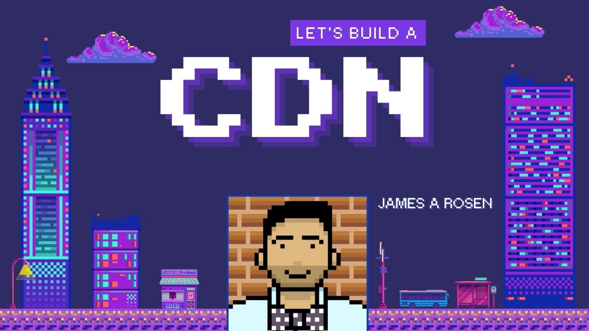

# How do we build a CDN on Fly.io?

## How did this start?

This started as a conversation between @jamesarosen & @gerhard in August 2023:
- https://github.com/thechangelog/changelog.com/discussions/480#discussioncomment-6844844

Several months later, this evolved into a few **epic** pairing sessions &
GitHub threads:
1. https://github.com/thechangelog/changelog.com/discussions/480#discussioncomment-6889082
2. https://github.com/thechangelog/changelog.com/issues/486

The last pairing session was the tipping point that eventually lead to [🎧
Kaizen 13 - Should we build a CDN?](https://changelog.com/friends/26). We
followed-up with a bunch of recorded sessions:

## What happened in the first recorded pairing session?

[🎬 Let's build a CDN](https://www.youtube.com/watch?v=8bDgWvyglno)

`./run demo-2024-01-26`

## And afterwards?

We then followed up with 🎧 Kaizen 15 - TBA.

`./run demo-2024-06-21`

## Are you planning any other follow-ups?

Yes! The plan is to pair-up with @jamesarosen sometime in July 2024 and see
where we take this next.
